<div align="center">

# Settlement Reconciliation

**Multi-source payment reconciliation with deterministic matching, bounded AI adjudication, and an exception-first policy engine.**

[](https://www.typescriptlang.org/)
[](https://nextjs.org/)
[](https://vitest.dev/)
[](https://www.postgresql.org/)
[](#data)
[](#failure-engineering)

**728 records · 5 sources · 1,098 held-out truth pairs · 0 false matches**

</div>

> **Core principle:** when the system cannot distinguish two financial records, it must refuse to guess.

<p align="center">
  <a href="#why-this-exists">Why</a> ·
  <a href="#results">Results</a> ·
  <a href="#architecture">Architecture</a> ·
  <a href="#the-engine">Engine</a> ·
  <a href="#where-ai-sits--and-where-it-does-not">AI boundary</a> ·
  <a href="#failure-engineering">Failures</a> ·
  <a href="#audit">Audit</a> ·
  <a href="#running-it">Run locally</a> ·
  <a href="#api">API</a>
</p>

---

# Why This Exists

Settlement reconciliation sounds simple:

> **Find the transaction that corresponds to this bank or settlement record.**

In real payment systems, it is not.

A single financial event can appear across:

* orders
* payments
* settlements
* bank statements
* invoices

And the records rarely agree perfectly.

A settlement is **not necessarily the order amount**.

It can be:

```text
Order amount
    − gateway fee
    − GST on fee
    = settlement amount
```

Bank narrations may wrap references in formats such as:

```text
NEFT/.../HDFC
```

References may be:

* truncated
* case-folded
* partially corrupted
* separated differently
* delayed
* affected by OCR-like errors

A credit may also arrive days after the original payment.

An exact database join therefore misses legitimate relationships.

But a fuzzy matcher creates a different danger:

> **Two financial records can look similar without being the same financial event.**

This project is designed around that tension.

---

# What It Solves

A reconciliation engine has two competing responsibilities:

1. **Recover as many true matches as possible.**
2. **Never manufacture a match merely because two records look similar.**

The system deliberately separates these responsibilities:

| Component          | Responsibility                               |
| ------------------ | -------------------------------------------- |
| **Blocking**       | Protect recall and generate candidates       |
| **Scoring**        | Rank candidates using deterministic evidence |
| **Adjudication**   | Provide a bounded second opinion             |
| **Policy**         | Own the final financial decision             |
| **Exceptions**     | Preserve uncertainty instead of hiding it    |
| **Audit receipts** | Make runs and reviews tamper-evident         |
| **Evaluation**     | Measure performance against held-out truth   |

The central invariant is:

> **Similarity creates candidates. Policy creates matches.**

---

# Results

**728 records across 5 sources, with 1,098 held-out ground-truth pairs.**

The matcher never sees ground truth during reconciliation.

| Metric             | Exact-join baseline | Fuzzy + adjudicator |
| ------------------ | ------------------: | ------------------: |
| Match rate         |               84.5% |           **89.0%** |
| Precision          |               1.000 |           **1.000** |
| Recall             |               0.596 |           **0.934** |
| F1                 |               0.747 |           **0.966** |
| False matches      |                   0 |               **0** |
| Missed pairs       |                 432 |              **30** |
| Exceptions raised  |                 113 |              **78** |
| Unresolved records |                 101 |               **3** |
| Throughput         |      ~8,000 rec/sec |      ~7,800 rec/sec |

### Per-defect evaluation

| Shape               | Truth pairs | Recovered | False | To a person |   Lost |    Recall |
| ------------------- | ----------: | --------: | ----: | ----------: | -----: | --------: |
| clean               |         360 |       360 |     0 |           0 |      0 | **1.000** |
| fee-deducted        |         340 |       340 |     0 |           0 |      0 | **1.000** |
| split-settlement    |         210 |       168 |     0 |          12 | **30** | **0.800** |
| timing-lag          |          66 |        66 |     0 |           0 |      0 | **1.000** |
| reference-typo      |          60 |        60 |     0 |           0 |      0 | **1.000** |
| missing-counterpart |           8 |         8 |     0 |           0 |      0 | **1.000** |
| duplicate           |          24 |        24 |     0 |           0 |      0 | **1.000** |
| many-to-one         |          30 |     **0** | **0** |      **30** |      0 | **0.000** |

---

# Reading These Results Honestly

## The many-to-one 0.000 recall is intentional

Three identical credits from one merchant on one day can have references mangled beyond recognition.

If nothing distinguishes them, the system does **not** randomly select one.

Instead:

```text
Ambiguous candidates
        ↓
   Policy detects
   mutual ambiguity
        ↓
     EXCEPTION
        ↓
   Human review
```

The important property is:

> **Uncertainty is preserved instead of converted into a false match.**

A matcher that reports a "correct" answer here may simply be lucky on this corpus.

---

## Split-settlement recall of 0.800 is the real weakness

30 truth pairs are currently lost outright.

The merge pass can recover a split when:

```text
part A + part B = whole
```

and the references are compatible.

However, it cannot currently recover every split where the reference is also mangled.

This is the largest known matching weakness.

---

## Precision is not presented as universal truth

The zero-false-match result is partly fitted to this synthetic corpus's reference format.

The reference-disambiguation rule is therefore documented explicitly rather than presented as a universal property of reconciliation.

A production system would need to re-derive these rules against the actual ledger distributions and operational loss data.

---

## Ground truth is never fabricated

Generated records have labelled truth groups.

Uploaded records do not.

Therefore:

> **The evaluator refuses to calculate precision and recall where ground truth does not exist.**

---

# Architecture

The entire system can be understood through **one end-to-end flow**:

```mermaid
flowchart LR

    %% =========================================================
    %% INPUTS
    %% =========================================================

    subgraph SOURCES["01 · FINANCIAL SOURCES"]
        O["Orders<br/>order_…"]
        P["Payments<br/>pay_…"]
        S["Settlements<br/>setl_…"]
        B["Bank Statements<br/>NEFT / HDFC / …"]
        I["Invoices<br/>tax · counterparty"]
    end

    %% =========================================================
    %% DATA PLANE
    %% =========================================================

    subgraph DATA["02 · DATA PLANE"]
        ING["INGESTION<br/><br/>Schema validation<br/>Malformed-row rejection<br/>Duplicate detection<br/>Upload-size limits"]

        NORM["NORMALIZATION<br/><br/>Reference cleanup<br/>Date normalization<br/>Amount normalization<br/>Currency normalization<br/>Fee / GST representation"]
    end

    %% =========================================================
    %% MATCHING
    %% =========================================================

    subgraph MATCH["03 · MATCHING PLANE"]
        BLOCK["BLOCKING<br/><br/>Recall-first candidate generation<br/>Reference · prefix · amount buckets<br/>Counterparty + date<br/><br/><b>Never makes a decision</b>"]

        SCORE["DETERMINISTIC SCORING<br/><br/>Five evidence features<br/>Amount agreement<br/>Reference similarity<br/>Date proximity<br/>Counterparty evidence<br/>Hard safety gates"]

        subgraph AI["BOUNDED AI BOUNDARY"]
            ADJ["ADJUDICATOR<br/><br/>Ambiguous band only<br/>Deterministic by default<br/>Optional OpenAI / Anthropic<br/>Confidence clamp ±0.12<br/><br/><b>AI proposes · AI does not decide</b>"]
        end

        POLICY["POLICY ENGINE<br/><br/>Resolve threshold<br/>Ambiguity detection<br/>Mutual exclusivity<br/>Missing-counterpart rules<br/><br/><b>ONLY COMPONENT ALLOWED<br/>TO MAKE FINAL DECISION</b>"]
    end

    %% =========================================================
    %% OUTCOMES
    %% =========================================================

    subgraph OUTCOMES["04 · CONTROLLED OUTCOMES"]
        RESOLVE["RESOLVE<br/><br/>High-confidence relationship<br/>passes policy"]
        EXCEPTION["EXCEPTION<br/><br/>Ambiguous / missing / unsafe<br/>money at risk preserved"]
    end

    %% =========================================================
    %% RECONCILIATION MODEL
    %% =========================================================

    subgraph RECON["05 · RECONCILIATION MODEL"]
        GROUP["CONNECTED RECONCILIATION GROUP<br/><br/>Union-Find + split merge<br/><br/>Order → Payment → Settlement → Bank"]
        REVIEW["HUMAN REVIEW<br/><br/>All indistinguishable candidates<br/>Context + evidence + amount at risk<br/>Decision retained"]
    end

    %% =========================================================
    %% AUDIT
    %% =========================================================

    AUDIT["HASH-CHAINED AUDIT LEDGER<br/><br/>Ingestion receipts<br/>Run receipts<br/>Review receipts<br/><br/>SHA-256(previous canonical payload)"]

    %% =========================================================
    %% EVALUATION / OPERATIONS
    %% =========================================================

    subgraph OPS["06 · EVALUATION + OPERATIONS"]
        GT["HELD-OUT GROUND TRUTH<br/><br/>Precision · Recall · F1<br/>Per-defect evaluation"]

        BASE["BASELINE COMPARISON<br/><br/>Exact join<br/>vs<br/>Fuzzy + adjudicator"]

        API["API + DEMO SURFACE<br/><br/>Ingest · Reconcile<br/>Matches · Exceptions<br/>Reviews · Evaluate · Audit"]

        VERIFY["VERIFICATION<br/><br/>Tests<br/>Typecheck<br/>Lint<br/>Build<br/>Reproducible corpus"]
    end

    %% =========================================================
    %% MAIN FLOW
    %% =========================================================

    O --> ING
    P --> ING
    S --> ING
    B --> ING
    I --> ING

    ING --> NORM
    NORM --> BLOCK
    BLOCK --> SCORE
    SCORE --> ADJ
    ADJ --> POLICY

    %% =========================================================
    %% DECISION
    %% =========================================================

    POLICY -->|High confidence + policy satisfied| RESOLVE
    POLICY -->|Ambiguous / missing / unsafe| EXCEPTION

    RESOLVE --> GROUP
    EXCEPTION --> REVIEW
    REVIEW --> AUDIT
    GROUP --> AUDIT
    POLICY --> AUDIT
    ING --> AUDIT

    %% =========================================================
    %% OPERATIONS
    %% =========================================================

    GROUP --> GT
    EXCEPTION --> GT
    GT --> BASE

    API -.-> ING
    API -.-> POLICY
    API -.-> REVIEW
    API -.-> AUDIT

    VERIFY -.-> DATA
    VERIFY -.-> MATCH
    VERIFY -.-> RECON

    %% =========================================================
    %% FAILURE / FALLBACK
    %% =========================================================

    ADJ -. "model unavailable" .-> FALLBACK["DETERMINISTIC FALLBACK<br/><br/>Batch continues<br/>fellBack = true"]
    FALLBACK -.-> POLICY

    %% =========================================================
    %% STYLING
    %% =========================================================

    classDef source fill:#111820,stroke:#68727e,color:#f4f0e8,stroke-width:1px
    classDef data fill:#171c22,stroke:#c59a45,color:#f4f0e8,stroke-width:2px
    classDef match fill:#171c22,stroke:#c59a45,color:#f4f0e8,stroke-width:2px
    classDef ai fill:#211a27,stroke:#9875ad,color:#f4f0e8,stroke-width:2px
    classDef policy fill:#201d17,stroke:#d1a957,color:#f4f0e8,stroke-width:3px
    classDef resolve fill:#14231e,stroke:#4d9677,color:#f4f0e8,stroke-width:2px
    classDef exception fill:#26191b,stroke:#a55c60,color:#f4f0e8,stroke-width:2px
    classDef audit fill:#1c1c1c,stroke:#d1a957,color:#f4f0e8,stroke-width:2px
    classDef ops fill:#15191e,stroke:#59636d,color:#f4f0e8,stroke-width:1px
    classDef fallback fill:#211d18,stroke:#9a7c45,color:#f4f0e8,stroke-width:1px

    class O,P,S,B,I source
    class ING,NORM data
    class BLOCK,SCORE match
    class ADJ ai
    class POLICY policy
    class RESOLVE,GROUP resolve
    class EXCEPTION,REVIEW exception
    class AUDIT audit
    class GT,BASE,API,VERIFY ops
    class FALLBACK fallback
```



### Architecture in one sentence

> **Five heterogeneous financial sources → validated ingestion → normalization → recall-first blocking → deterministic scoring → bounded AI adjudication → policy-controlled decision → resolved reconciliation group OR money-at-risk exception → human review → hash-chained audit.**

---

# The Engine

The system has clear decision boundaries.

```text
INGEST
   │
   ▼
NORMALIZE
   │
   ▼
BLOCKING
   │
   │  recall only
   ▼
SCORING
   │
   │  evidence only
   ▼
ADJUDICATOR
   │
   │  ambiguous band only
   ▼
POLICY
   │
   ├───────────────► RESOLVE
   │
   └───────────────► EXCEPTION
                              │
                              ▼
                         HUMAN REVIEW
                              │
                              ▼
                         AUDIT LEDGER
```

The important distinction is:

```text
Blocking      → finds candidates
Scoring       → measures evidence
Adjudicator   → gives bounded second opinion
Policy        → makes decision
Exception     → preserves uncertainty
Audit         → records what happened
```

---

# 1. Blocking

Blocking is **recall-only**.

Keys are deliberately loose and overlapping:

* reference
* reference prefix
* adjacent amount buckets
* counterparty + date

The goal is:

> **A missed block is a missed match forever.**

728 records produce roughly **2,000 candidate pairs** instead of 264,628.

Precision is therefore left entirely to scoring and policy.

---

# 2. Scoring

Scoring produces five feature values and a weighted total.

It does **not** make the final decision.

Two hard gates are enforced.

## Currency mismatch

Different currencies are incomparable.

The pair scores zero.

## Same-source records

Two records from the same source score zero.

Reconciliation means finding a counterpart in a different system.

---

# Amount Agreement

Amount agreement is not simply:

```text
|a - b| < ε
```

A difference explainable by:

```text
gateway fee + 18% GST
```

receives a strong score.

The score then decays as the unexplained difference grows.

This feature contributes significantly to the recall improvement:

```text
0.596 → 0.934
```

---

# Policy Engine

The policy engine is the **only component allowed to make the final decision**.

Its most important rule is:

> **Ambiguity is mutual exclusivity, not similarity.**

Two candidates are mutually exclusive when:

1. They come from the same source.
2. Each one independently accounts for the subject's amount.

This distinction matters.

Consider:

```text
Order
  │
  ├── Payment
  ├── Settlement
  └── Bank line
```

The other three records may all look highly similar.

They are not three competing answers.

They are the other components of the same financial event.

---

## Split settlement

For example:

```text
Order: ₹1,000

Bank line A: ₹400
Bank line B: ₹600
```

These are complementary.

```text
₹400 + ₹600 = ₹1,000
```

The system can therefore merge them into one reconciliation relationship when the other policy conditions are satisfied.

---

## True ambiguity

Now consider:

```text
Order: ₹1,000

Bank line A: ₹1,000
Bank line B: ₹1,000
```

These are alternatives.

Picking one is guessing.

The correct outcome is:

```text
                    ┌── Bank line A
Order → ambiguity ──┤
                    └── Bank line B
                           │
                           ▼
                      EXCEPTION
                           │
                           ▼
                     HUMAN REVIEW
```

---

# Matches Are Groups, Not Pairs

The system does not treat reconciliation as a collection of isolated pairwise matches.

Confirmed relationships are unioned into **connected components**.

Example:

```text
                  ┌── Payment
                  │
Order ────────────┼── Settlement
                  │
                  └── Bank statement
```

These become one reconciliation group.

This allows the system to reason about the **complete financial event** rather than producing disconnected pair matches.

The implementation uses:

```text
Union-Find
+
Split-settlement merge
```

---

# Where AI Sits — And Where It Does Not

The default system is deterministic.

The adjudicator is invoked **only for candidates inside the ambiguous band**.

## AI can

* nudge confidence within a strict bound
* provide a reason
* identify contextual evidence
* help distinguish difficult candidate relationships

## AI cannot

* resolve a match by itself
* bypass the policy engine
* push a candidate across the resolve threshold
* access ground truth
* override ambiguity rules
* silently change the final decision

The architecture is intentionally:

```text
AI proposes
     │
     ▼
Deterministic policy validates
     │
     ├──────────────► RESOLVE
     │
     └──────────────► EXCEPTION
```

Therefore:

> **AI is a bounded second opinion, not the source of truth.**

---

# Adjudicator Modes

## Deterministic

The deterministic adjudicator is the default.

No external model is required.

It recognizes patterns such as:

* fee + GST differences
* known settlement-cycle delays
* clean reference-prefix truncation
* counterparty-supported matches

This keeps the benchmark reproducible.

---

## OpenAI / Anthropic

Optional model-backed adjudication can be enabled with:

```text
ADJUDICATOR=openai
```

or:

```text
ADJUDICATOR=anthropic
```

with:

```text
LLM_API_KEY=...
```

The model receives the same normalized information and operates under the same confidence clamp.

The external model does **not** become the final authority.

---

## Model failure

If the adjudicator becomes unavailable:

```text
model failure
     │
     ▼
deterministic fallback
     │
     ▼
fellBack = true
     │
     ▼
policy continues
```

The batch does not silently fail.

It also does not silently resolve through a missing model.

---

# Failure Engineering

Financial systems should be designed around their failure modes.

| Failure               | Caught where | What happens                                     | What must never happen      |
| --------------------- | ------------ | ------------------------------------------------ | --------------------------- |
| Ambiguous many-to-one | Policy       | Exception with every indistinguishable candidate | Confident coin-flip         |
| Missing counterpart   | Policy       | `MISSING_COUNTERPART` + amount at risk           | Low-confidence match        |
| Duplicate delivery    | Ingestion    | Stored with `duplicateOfId`                      | Second match                |
| Malformed row         | CSV parser   | Rejected with line number                        | Coercion                    |
| Oversized upload      | Ingestion    | HTTP 413                                         | Parse first                 |
| Adjudicator down      | Adjudicator  | Deterministic fallback                           | Batch failure               |
| No ground truth       | Evaluator    | Metrics refused                                  | Fabricated precision/recall |

---

# Exception Queue

Exceptions are ordered by:

> **Money at risk**

rather than chronological order.

If a controller has forty exceptions and one hour, the highest-value uncertainties should be reviewed first.

When three records are indistinguishable, the queue shows **all three**.

It does not reduce the situation to:

```text
Candidate A

Approve?
```

That would turn a coin flip into an apparently human-approved decision.

Instead:

```text
Exception
   │
   ├── Candidate A
   ├── Candidate B
   └── Candidate C
          │
          ▼
    Human review
```

The original uncertainty remains visible.

---

# Audit

Every ingestion, reconciliation run, and review appends a **hash-chained receipt**.

Each receipt contains the SHA-256 hash of the previous canonical payload.

Conceptually:

```text
┌─────────────────────┐
│     Receipt N       │
│                     │
│ payload             │
│ SHA-256(payload)    │
│ previousHash        │
└──────────┬──────────┘
           │
           ▼
┌─────────────────────┐
│     Receipt N+1     │
│                     │
│ payload             │
│ SHA-256(payload)    │
│ previousHash        │
└─────────────────────┘
```

Therefore:

* removing a receipt breaks the chain
* editing a receipt breaks its own hash
* each important state transition remains traceable

The system detects removal and modification as separate incidents because they represent different audit conditions.

---

# Data

All included data is **synthetic**.

Identifiers intentionally resemble payment infrastructure:

```text
order_...
pay_...
setl_...
```

This makes the relationships realistic without using live payment data.

## No live credentials

The repository:

* does not read live credentials
* does not call Razorpay production endpoints
* does not depend on live payment data

The corpus uses fixed counts per defect shape rather than probability sampling.

This guarantees that difficult cases remain present on every evaluation run.

---

## Reference corruption

The generator models realistic failure patterns such as:

* truncation
* case folding
* separator substitution
* OCR-like confusions
* dropped characters

---

# Design

## Art Deco, 1931

The interface uses an Art Deco-inspired visual language:

* midnight ground
* brass rules
* stepped geometry
* wide display typography
* symmetrical composition

The visual language mirrors the reconciliation model:

```text
BOOKS                         BANK

  │                             │
  │────────── MATCH ────────────│
  │                             │
```

The match-detail view uses a **tie-line ledger**:

```text
BOOKS                         BANK

Order ────────────────────────┐
                              │
Payment ──────────────────────┼────── Bank
                              │
Settlement ───────────────────┘
```

Residuals are displayed on the centre axis.

---

# Running It

```bash
npm install

npm run db:migrate

npm run gen:ledgers

npm run reconcile

npm run reconcile -- --baseline

npm run evaluate

npm test

npm run verify
```

## What each command does

| Command                           | Purpose                                              |
| --------------------------------- | ---------------------------------------------------- |
| `npm install`                     | Install dependencies                                 |
| `npm run db:migrate`              | Run database migrations                              |
| `npm run gen:ledgers`             | Generate seeded synthetic ledgers                    |
| `npm run reconcile`               | Run reconciliation                                   |
| `npm run reconcile -- --baseline` | Run exact-join baseline                              |
| `npm run evaluate`                | Evaluate precision, recall, F1 and per-shape results |
| `npm test`                        | Run test suite                                       |
| `npm run verify`                  | Typecheck + lint + tests + build                     |

---

# Database

The default deployment uses:

```text
DATABASE_URL=pglite://:memory:
```

This runs entirely in memory.

The same migrations can be used with PostgreSQL:

```text
DATABASE_URL=postgres://...
```

The deployed environment generates, reconciles, and evaluates the corpus during bootstrap.

---

# API

## Ingest

```http
POST /api/ingest
```

Generate or upload records.

Generate:

```json
{
  "mode": "generate"
}
```

Or upload CSV:

```json
{
  "mode": "csv",
  "kind": "...",
  "csv": "..."
}
```

---

## Reconcile

```http
POST /api/reconcile
```

Run reconciliation.

```json
{
  "strategy": "fuzzy+adjudicator",
  "thresholds": {
    "resolve": 0.82
  }
}
```

---

## Matches

```http
GET /api/matches?runId=...
```

Retrieve reconciliation matches.

---

## Exceptions

```http
GET /api/exceptions?runId=...
```

Retrieve exceptions ordered by money at risk.

---

## Evaluate

```http
POST /api/evaluate
```

Run evaluation.

```json
{
  "withBaseline": true
}
```

---

## Human reviews

```http
POST /api/reviews
```

Record human review.

```json
{
  "exceptionId": "...",
  "outcome": "ESCALATED",
  "note": "..."
}
```

---

## Audit

```http
GET /api/audit
```

Retrieve the audit ledger.

---

## Demo scenarios

```http
POST /api/demo/clean-batch
POST /api/demo/fee-mismatch
POST /api/demo/many-to-one-exception
POST /api/demo/missing-counterpart
POST /api/demo/baseline-vs-ai
```

---

## Health

```http
GET /api/health
```

Health check.

---

# Tuned, Not Derived

The following thresholds were selected by running the synthetic corpus and observing where precision and recall crossed.

They are **not universal financial rules**.

| Parameter              |   Value | Purpose                  |
| ---------------------- | ------: | ------------------------ |
| `resolve`              |  `0.82` | Resolve threshold        |
| `floor`                |  `0.45` | Minimum candidate score  |
| `ambiguityMargin`      |  `0.08` | Near-tie detection       |
| `dateWindowDays`       |    `12` | Settlement timing window |
| `feeToleranceFraction` | `0.035` | Fee tolerance            |
| `roundingSlackMinor`   |   `200` | ₹2 rounding tolerance    |
| adjudicator clamp      | `±0.12` | Maximum AI influence     |
| serial-reference score |   `0.3` | Candidate-only signal    |

A production deployment would re-derive these values against real ledger distributions and operational loss data.

---

# Known Limits

The system deliberately documents what it cannot currently solve.

## 1. Mangled split-settlement references

Split settlements whose references are also mangled can currently be lost rather than queued.

**This is the largest known weakness.**

---

## 2. Corpus-specific precision

The zero-false-match result depends partly on the synthetic reference format.

The reference rule must be re-derived for another ledger convention.

---

## 3. Default adjudicator is deterministic

The reported benchmark numbers were produced without an external model.

This keeps evaluation reproducible.

---

## 4. Large blocks

Blocks larger than 60 records are skipped rather than sampled.

---

## 5. Candidate persistence

Candidates are persisted as a capped sample of 500 per run.

The run page exposes both the sampled and total counts so the table cannot be mistaken for the complete candidate set.

---

# Engineering Principles

This project is built around a few non-negotiable principles:

```text
Similarity creates candidates.
Policy creates matches.

AI proposes.
Deterministic code decides.

Uncertainty becomes an exception.
It does not become a guess.

Ground truth is measured.
It is never invented.

Every important decision leaves an audit trail.
```

---

# Why This Architecture

The goal is not to build a system that claims to match everything.

The goal is to build a system that can answer:

> **"Why did you match these records?"**

And, equally importantly:

> **"Why didn't you match those records?"**

For financial reconciliation, that distinction matters more than a single headline accuracy number.

The architecture therefore optimizes for:

```text
RECALL
  +
PRECISION
  +
EXPLAINABILITY
  +
FAILURE SAFETY
  +
AUDITABILITY
```

rather than blindly optimizing for:

```text
"match as much as possible"
```

---

# Core Invariant

Everything in this repository ultimately reduces to one rule:

```text
                    ┌─────────────────────┐
                    │      SIMILARITY     │
                    └──────────┬──────────┘
                               │
                               ▼
                         CANDIDATES
                               │
                               ▼
                    ┌─────────────────────┐
                    │      POLICY         │
                    │                     │
                    │ Can we distinguish  │
                    │ this safely?        │
                    └──────────┬──────────┘
                               │
                  ┌────────────┴────────────┐
                  │                         │
                  ▼                         ▼
              RESOLVE                   EXCEPTION
                  │                         │
                  ▼                         ▼
              GROUP                  HUMAN REVIEW
                  │                         │
                  └────────────┬────────────┘
                               ▼
                         AUDIT RECEIPT
```

> **A financial system should be aggressive about finding possibilities and conservative about declaring certainty.**

---

<div align="center">

### Built for trustworthy financial automation.

**Recover aggressively. Decide conservatively. Audit everything.**

</div>
